# Demo模板系统简要说明

#### <span style="color:red">特别强调：修改模板文件或者程序文件后，请一定要清空tmp目录，否则修改不生效。</span>

### Demo系统模板系统简单说明
Demo系统是基于XiuruoBBS系统修改的，采用 Bootstrap 4 + JQuery 3 作为前端类库，全面支持移动端浏览器；所以在模板修改的过程中可以参考bootstrap4的文档进行修改。

默认风格的参考模板在 view 文件夹下, 
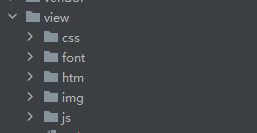

1. css 目录为系统基础的css目录文件所在位置，实际上就是bootstrap 工具包CSS的位置，基本上不用做任何修改
2. font 是系统中所使用字体所在的位置，如果需要加入新的字体，可以放在此目录里面
3. htm 为默认模板所在的位置，模板的修改基本上都在这个目录下完成
4. img 为图片素材所在的位置，如果需要修改系统的logo可以在这个目录下完成
5. js 为系统使用的Javascript库文件所在的目录，如果需要一个前端特效，需要使用其他的Javascript库文件，均可以放在此目录下

#### htm 目录中文件结构的说明
###### 部分文件在新的系统中没有实际作用，但是暂时未删除，下面展示主要的文件列表：
```
index.htm : 首页模板,
header.inc.htm : 头部模板
header_nav.inc.htm : 头部导航文件
footer.inc.htm : 尾部模板
footer_nav.inc.htm : 尾部模板的导航文件，版权信息文件
thread_list.inc.htm : 帖子列表模板 (循环)
thread.htm : 帖子内容模板
post_list.inc.htm : 回复列表模板 (循环)
post.htm : 发布帖子模板
forum.htm : 板块模板
user.htm : 板块模板
my.htm : 个人中心模板
my_profile.htm : 个人中心 – 资料 模板
user_profile.htm : 用户个人中心 – 资料 模板
```
#### 系统调用模板的方式
系统程序的入口程序在 **route** 目录下，下面是涉及到的常用入口程序
```
auth.php : 用于处理用户登录后的回调问题，对于用户在留园系统完成登录授权后的操作，在这里完成修改
forum.php : 板块首页程序，这里主要是用来展示板块的帖子列表，以及右边的扩展帖子信息的列表
index.php : 首页程序，包含了搜索和我的关注圈的数据获取
post.php : 评论程序的入口，在此文件中处理
thread.php : 包含了发帖程序和帖子内容阅读程序以及点赞功能
user.php : 包含了用户的个人信息以及前期帖子的信息

```
在所有的程序中，调用模板的方式是
`include _include(APP_PATH.'view/htm/模板文件');`
这里的<span style="color:red">模板文件</span>指的就是 view/htm/下的htm文件，比如调用首页模板的时候，使用的就是
`include _include(APP_PATH.'view/htm/index.htm');`


#### 系统中PHP的公用变量和常量
这些公用变量是可以在任何模板中直接使用的
```
APP_PATH ： 网站所在的根目录路径

$uid : 登录用户的ID，如果未登录，则为0
$user : 登录用户的个人信息，如果未登录，则为NULL
$forumlist_show : 当然分站开通的板块信息列表，是个数组，可以通过foreach遍历
$conf : 系统的配置文件信息，如果您需要增加新的变量，则可以在conf目录下修改conf.php中的内容增加变量
$auth_config : 认证系统的配置信息，对应的是 conf目录下的 conf.auth.php里面的配置信息，如果需要修改一些认证域名，资源域名，请在conf.auth.php里面修改

```


#### 特别强调，默认情况下，所有的帖子列表的子元素结构均包含如下字段：
```
{
            "cid": "内容编号",
            "bbsid": "板块ID",
            "title": "标题",
            "dateline": "发布时间",
            "author": "发布人",
            "uid": "发布人ID",
            "username": "发布人",
            "sitename": "板块名称",
            "src": "来源",
            "replies": "评论数",
            "likes": "点赞数",
            "pic": "图片数",
            "pic_src": [
                "图片地址数组"
            ]
},
```

#### 如何快速的套用一套全新的模板页面呢？
如果您对于demo提供的模板系统不是特别满意，那么您可以从网络或者自己设计一套自己满意的模板出来，然后下面讲大概讲解下快速套用一套全新模板系统的基本流程
1. 你首先需要拥有一个完整的HTML网页模板，包含了CSS,Javascript文件，以及图片素材的文件
2. 备份view目录下的全部内容
3. 将首页的模板文件修改成 index.htm，然后覆盖 view/htm/index.htm 文件
4. 修改index.htm 文件中的资源素材的相对位置，包含且不限于 CSS 图片 Js文件 字体等。这里特别注意一点，因为在CSS中引用图片文件的时候会使用CSS文件和图片的相对位置，所以原始模板中 CSS文件和图片素材的相对位置请保留，不要随意更改目录的名字和更改位置，<span style="color:red">特别强调：素材文件的目录并不是一定要和前面系统默认的文件位置保持一致，最好是根据模板本身的相对位置存放 </span>
5. 全部修改完毕后，一定要做一件事情，<span style="color:red">删除tmp目录下所有的内容，清空缓存！！！！</span>,否则模板修改不生效。
6. 访问网站首页，看是否显示出了完整的首页，注意这里应该显示出模板文件的全貌，如果出现变形或者素材不正确，请检查模板文件中的素材位置是否存在，或者位置是否正确，如果错误请按照实际位置修改。
7. 在保证系统模板文件能够正常完整浏览的情况下，然后把备份的原始模板打开，把里面输出的PHP代码部分复制出来，按照自己模板的实际需要，摆放在实际位置即可，

下面就是系统主要模板文件的讲解，部分入口文件，已经列出了可用的变量名以及其对应功能，直接拿来使用即可
模板中输出变量的方式：
```
<?=变量名?>
比如
<?=$_uid?>
```
或者
```
<?php
echo $_uid;
?>
```
都可以，

#### 主要模板文件的说明
##### 1. header.inc.htm 头部模板
在几乎所有的模板文件中，基本的结构都是这样的
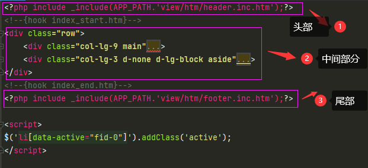

1. 第1部分为加载公用的头部文件
2. 第2部分为加载中间的部分，符合bootstrap的 row的划分
3. 第3部分为公用尾部

其中第一部分头部模板 header.inc.htm文件
**head**
里面主要进行网站关键字，网站名称，以及公用CSS文件 JS的加载，默认情况下，基本上都不用修改。如果需要变更背景这些，变更网站整体造型，那么就需要加载新的全局CSS文件，就在这里进行修改。

##### 2. header_nav.inc.htm 头部导航的模板
在这个文件里面，头部导航条的定制，包含了修改logo文件地址，修改头部样式，均在这里修改
精简后的头部结构如下
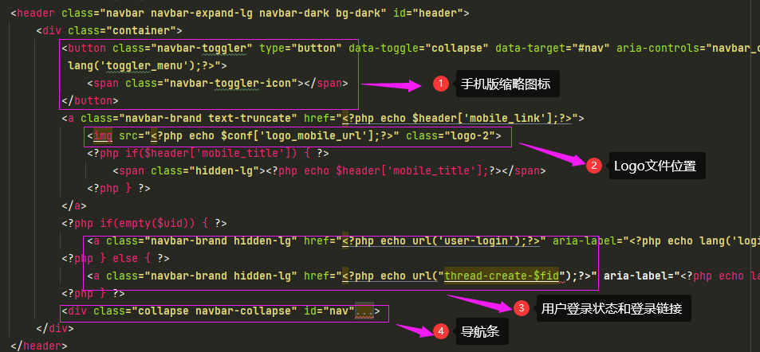

1. 其中在2的部分可以修改Logo文件的位置
2. 在4的部分，是进行导航条循环的地方
3. 
```
<ul class="navbar-nav mr-auto">
	<li class="nav-item home" fid="0" data-active="fid-0"><a class="nav-link" href="."><i class="icon-home d-md-none"></i>首页</a></li>
<?php foreach($forumlist_show as $_forum) { ?>
    <li class="nav-item" fid="" data-active="">
        <a class="nav-link" href="板块链接"><i class="icon-circle-o d-md-none"></i>板块名称</a>
    </li>
<?php } ?>
</ul>
```
代码中
`foreach($forumlist_show as $_forum)`
为循环一个数组 **$forumlist_show** 的过程 **$forumlist_show** 中保存的就是系统定制的板块列表
其中 $_forum 中包含了fid 和 name 分别对应板块的id和名字
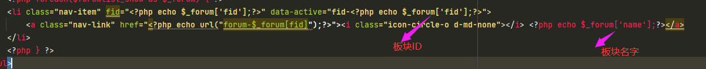

##### 3. footer.inc.htm 头部导航的模板
该模板中，主要用于定义公用的JS文件和一些最后加载的CSS文件
```
<script src="lang/<?php echo $conf['lang'];?>/bbs.js<?php echo $static_version;?>"></script>
<script src="<?php echo $conf['view_url'];?>js/jquery-3.1.0.js<?php echo $static_version;?>"></script>
<script src="<?php echo $conf['view_url'];?>js/popper.js<?php echo $static_version;?>"></script>
<script src="<?php echo $conf['view_url'];?>js/bootstrap.js<?php echo $static_version;?>"></script>
<script src="<?php echo $conf['view_url'];?>js/xiuno.js<?php echo $static_version;?>"></script>
<script src="<?php echo $conf['view_url'];?>js/bootstrap-plugin.js<?php echo $static_version;?>"></script>
<script src="<?php echo $conf['view_url'];?>js/async.js<?php echo $static_version;?>"></script>
<script src="<?php echo $conf['view_url'];?>js/form.js<?php echo $static_version;?>"></script>
	<script>
```

##### 4. footer_nav.inc.htm 头部导航的模板
主要是页面尾部的一些版权信息和网站链接信息，可以自定义，或者删除红色区域圈住的内容
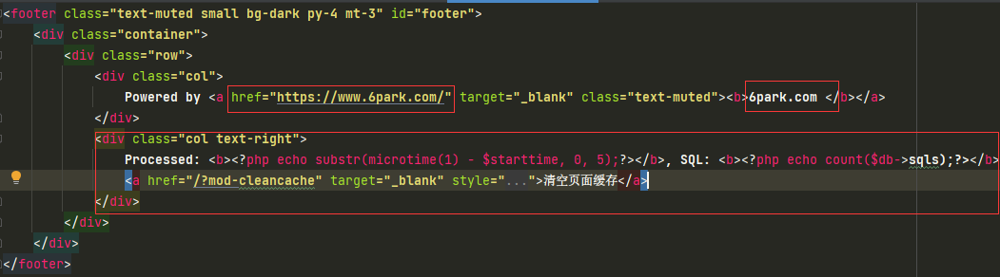
当然为了保证保持bootstrap的基本结构，最少应该保证有如下内容存在：
```
<footer class="text-muted small bg-dark py-4 mt-3" id="footer">
	<div class="container">
		<div class="row">
			
		</div>
	</div>
</footer>
```

##### 5. index.htm 首页模板
对应的是 route/index.php
页面中的可用变量名
1. $action 
    1. 值为 'default' 表示首页
    2. 值为 'followc' 表示关注圈
    3. 值为 'search' 表示搜索结果
2. $threadlist 帖子列表数组，可以通过foreach遍历获取到帖子列表
3. $pagination 分页的代码变量，这个可以自己生成
4. $hostList 最近3天的热评贴列表

模板基本框架：分为右边和左边部分
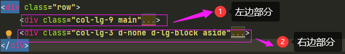

在左边部分，基本上就是帖子的列表页，这里的帖子列表页，使用了一个公用的帖子列表模板实现
```
<?php include _include(APP_PATH.'view/htm/thread_list_mod.inc.htm');?>
在这个系统中，大部分的帖子列表均使用 这个公用的模板来实现，
```

在右边部分
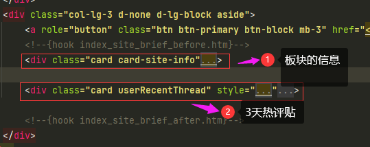
上面部分是对应的网站的基本信息展示
下面部分是一个扩展区域，目前放的是最近3天的热帖
3天热评贴的列表的部分代码如下
```
<div class="card userRecentThread" style="top:0px">
			<h6 class="card-header">72小时热评榜 </h6>
			<div class="card-body py-3" style="padding:1rem;font-size:12px;line-height:25px;overflow: hidden;text-overflow: ellipsis;">
			<?php
			foreach($hostList as $hot){
			?>
				<span class="line-height-2">
					<span class="icon-slack"></span>&nbsp;<a href="/?thread-<?=$hot['cid']?>.htm">
					<?=$hot['title']?>
					<span class="ml-2 badge badge-pill badge-info"><?=$hot['replies']?> 评</span><br></a>
				</span>
			<?php
			}
			?>
			</div>
		</div>
		

$hostList 的数据结构符合前面设定的帖子列表结构特征。
```
##### 6.thread_list_mod.inc.htm 公用帖子列表模板
在这个模板里面，主要有2部分代码第一部分
```
<?php
    if(!empty($_thread['pic_src']))
    {
    ?>
<div class="spic ml-1 mt-1 mr-3">
    <a href="thread-21436.htm">" width="100"></a>
</div>
<?php
    }
    ?>
```
如果图片数组不为空的时候，则显示第一张图片为前缀图片，
第二部分代码为帖子列表结构区
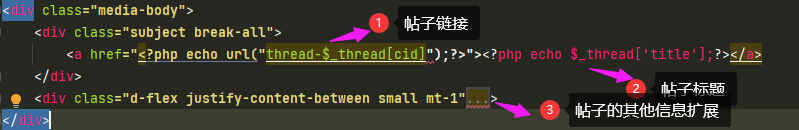

主要分3个区域
1. 帖子的链接
2. 帖子的标题
3. 帖子的扩展信息，比如来源，评论数，点赞数等，发帖时间也可以在这里展示。

##### 7.forum.htm 板块的帖子列表区
对应的是 route/forum.php
页面中的可用变量名
1. $fid 板块的编号
2. $bbsInfo 板块信息，主要用于展示在右边的板块信息内，基本数据结构如下：
```
{
    "info": {
        "name": "板块名称",
        "info": "板块的简单说明",
        "manager": [
            版主列表
        ],
        "account": "板块金币信息"
    },
}    
```
3. $picList 如果在这个板块中，该值为true的时候，则使用图片型帖子列表样式。
4. $threadlist 帖子列表数组，可以通过foreach遍历获取到帖子列表，如果传递了digest=1的话，就是精华帖
5. $hotview 72小时的点击最高的帖子列表
6. $hotList 最近3天的热评贴列表

模板基本框架：和前面的index.htm一样，都是分为左右结构，左边为帖子列表页，在左边的帖子列表页，分成了2种列表样式，第一种是
```
<?php include _include(APP_PATH.'view/htm/thread_list.inc.htm');?>
```
前面默认的帖子列表样式
第二种
```
<?php include _include(APP_PATH.'view/htm/thread_list_pic.inc.htm');?>
```
对于视频类，图片类站点，可以使用 图片瀑布型的帖子列表样式。

右侧为扩展区
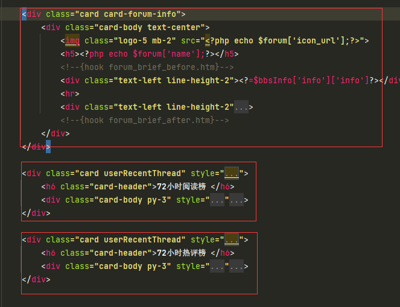

三个区域
1. 板块信息，包含了板块的名字，板块的信息，板块的版主列表，主要是展示 $bbsInfo 中的内容
2. 72小时阅读榜，显示的是 $hotview 的帖子列表信息遍历
3. 72小时热评榜，显示的是 $hotList 的帖子列表信息遍历

##### 8.thread_list_pic.inc.htm 图片型帖子列表展示方式模板
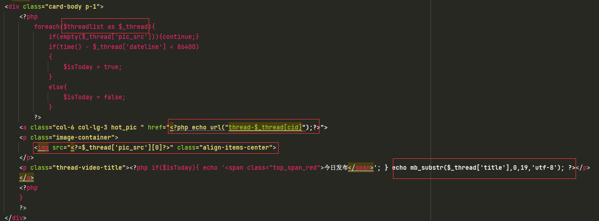
相对来说内容比较简单
第一部分，遍历 $threadList 帖子列表
第二部分，帖子的链接地址
第三部分，帖子的图片
第四部分，截取后的帖子标题

##### 9.thread.htm 帖子内容页
对应的是 route/thread.php
页面中的可用变量名
1. $tid 帖子ID
2. $thread 帖子信息，帖子信息的结构为
```
{
    "isFollow": 是否关注发帖人,
    "title": "标题",
    "bbsid": "板块编号",
    "tid": "帖子编号",
    "dateline": "发帖时间",
    "content": "帖子内容",
    "src": "帖子来源",
    "replies": 评论数,
    "likes": 点赞数,
    "views": 阅读次数,
    "user":{
        'uid'："发帖人ID",
        'username' ："发帖人名字",
        'sex'："发帖人性别",
        'grade'："发帖人等级",
    }
}    
```
3. $postlist 评论列表。
4. $userThread 楼主的前期帖子列表，可以通过foreach遍历获取到帖子列表
5. $hotview 72小时的点击最高的帖子列表
模板仍然采用的是左右结构，左边为帖子内容
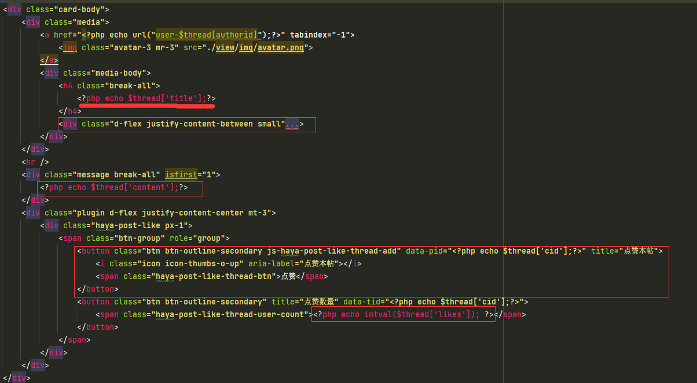
从上往下，分别是
1. 帖子的标题，对应的是 $thread['title']
2. 帖子的一些附加属性，包含了发帖人，发帖时间，点击次数等变量数据
3. 帖子的内容
4. 点赞按钮

再往下系统加载了一个模板 post_list.inc.htm
```
<?php include _include(APP_PATH.'view/htm/post_list.inc.htm'); ?>
```

这里是显示 评论列表的地方，评论列表的内容，都显示在 post_list.inc.htm 模板中。

右侧是发帖用户的信息，以及 热帖和 楼主前期帖子，基本结构和前面的 板块 首页的一样，只是循环的变量不同。

##### 9.post_list.inc.htm 评论列表嵌套模板页
该模板是用来展示内容下方的评论列表的，
基本上结构是
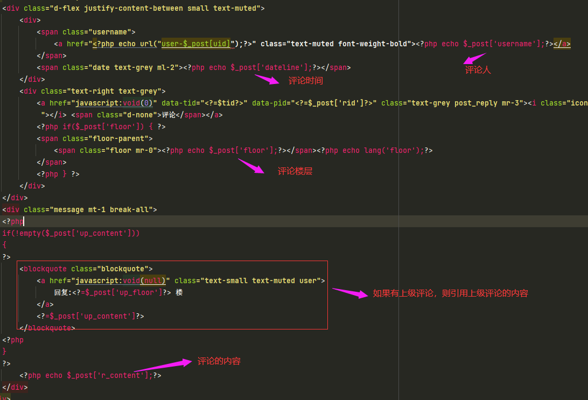

相对来说，就是各个变量摆放在各自的位置即可。


